# QualitasCareAPI — Domain Class Diagram

> Diagrama gerado automaticamente a partir do mapeamento dos módulos do projeto.
> Versão completa em PlantUML: `domain-class-diagram.puml`

## Módulos

| Módulo | Responsabilidade | Classes |
|--------|-----------------|---------|
| **IAM** | Identidade, usuários, setores, tenants | Tenant, User, Setor, OrgRoleAssignment |
| **Security** | Permissões, roles, políticas de acesso | Role, Permission, Policy, RolePermission, UserPermissionOverride |
| **Common** | Recursos compartilhados | EvidenciaArquivo |
| **Core** | Kits e instrumentos cirúrgicos | KitProcedimento, KitVersion, KitItem, Instrumento, ExameCultura |
| **CME** | Central de Material e Esterilização | Autoclave, CicloEsterilizacao, LoteEtiqueta, ProcessoReprocessamento, + 14 classes |
| **GED** | Gestão Eletrônica de Documentos | Document, DocumentVersion, PopProfile, ProtocolProfile, + 10 classes |
| **Approval** | Fluxos de aprovação multi-estágio | ApprovalFlowDef, ApprovalRequest, ApprovalStep, + 3 classes |
| **Quality** | Não conformidades e planos de ação | NaoConformidadeCME, PlanoAcaoItem, NCEficaciaAvaliacao, TipoNaoConformidade |
| **HR** | Recursos humanos e colaboradores | Cargo, Colaborador |
| **EDU** | Educação e treinamento | Course, Enrollment, TrainingPlan, Competency, + 17 classes |
| **Environmental** | Gestão de resíduos | GeracaoResiduo |

---

## Diagrama Mermaid (visão simplificada por módulo)

```mermaid
classDiagram
direction TB

%% ============================================================
%% INTERFACES
%% ============================================================
class ApprovableTarget {
  <<interface>>
}
class NaoConformidadeBase {
  <<interface>>
  +getId() Long
  +getTitulo() String
  +getStatus() NaoConformidadeStatus
}

%% ============================================================
%% IAM
%% ============================================================
class Tenant {
  +id: Long
  +code: String
  +name: String
  +cnpj: String
  +active: boolean
}
class User {
  +id: Long
  +username: String
  +fullName: String
  +status: UserStatus
  +origin: IdentityOrigin
  +createdAt: LocalDateTime
}
class Setor {
  +id: Long
  +nome: String
  +tipo: TipoSetor
}
class OrgRoleAssignment {
  +id: Long
  +roleType: OrgRoleType
  +active: Boolean
}

Tenant "1" --> "0..*" User
Tenant "1" --> "0..*" Setor
OrgRoleAssignment --> Tenant
OrgRoleAssignment --> User
OrgRoleAssignment --> Setor

%% ============================================================
%% SECURITY
%% ============================================================
class Role {
  +id: Long
  +name: String
  +description: String
}
class Permission {
  +id: Long
  +resource: ResourceType
  +action: Action
  +code: String
}
class Policy {
  +id: Long
  +resource: ResourceType
  +effect: Effect
  +enabled: boolean
  +priority: int
}
class PolicyCondition {
  +id: Long
  +type: String
  +operator: String
  +value: String
}
class RolePermission {
  +id: Long
}
class UserPermissionOverride {
  +id: Long
  +resource: ResourceType
  +effect: Effect
  +validFrom: LocalDateTime
  +validUntil: LocalDateTime
}

UserPermissionOverride ..|> ApprovableTarget
Policy "1" *-- "0..*" PolicyCondition
User --> Role
RolePermission --> Role
RolePermission --> Permission
UserPermissionOverride --> User
UserPermissionOverride --> Tenant

%% ============================================================
%% COMMON
%% ============================================================
class EvidenciaArquivo {
  +id: Long
  +nomeArquivo: String
  +uri: String
  +hashSha256: String
  +contentType: String
  +tamanhoBytes: Long
  +criadoEm: LocalDateTime
}
EvidenciaArquivo --> Tenant
EvidenciaArquivo --> User

%% ============================================================
%% CORE
%% ============================================================
class KitProcedimento {
  +id: Long
  +nome: String
  +codigo: String
  +ativo: Boolean
}
class KitVersion {
  +id: Long
  +numeroVersao: Integer
  +vigenciaInicio: LocalDate
  +validadeDias: Integer
}
class KitItem {
  +id: Long
  +quantidade: Integer
}
class Instrumento {
  +id: Long
  +nome: String
  +codigoHospitalar: String
}
class ExameCultura {
  +id: Long
  +origemAmostra: String
  +dataColeta: LocalDate
  +resultado: ExameCulturaResultado
}

KitProcedimento --> Tenant
KitVersion --> KitProcedimento
KitItem --> KitVersion
KitItem --> Instrumento
ExameCultura --> Tenant

%% ============================================================
%% CME
%% ============================================================
class Autoclave {
  +id: Long
  +nome: String
  +fabricante: String
  +modelo: String
  +numeroSerie: String
  +ativo: Boolean
}
class RecebimentoMaterial {
  +id: Long
  +dataHora: LocalDateTime
  +quantidadeItens: Integer
  +status: RecebimentoStatus
}
class ProcessoReprocessamento {
  +id: Long
  +numeroProcesso: String
  +status: ProcessoStatus
  +dataAbertura: LocalDateTime
}
class LoteEtiqueta {
  +id: Long
  +codigo: String
  +validade: LocalDate
  +status: LoteStatus
  +qrCode: String
}
class CicloEsterilizacao {
  +id: Long
  +inicio: LocalDateTime
  +fim: LocalDateTime
  +status: CicloStatus
  +parametrosOk: Boolean
  +ibOk: Boolean
}
class IndicadorQuimico {
  +id: Long
  +tipo: String
  +resultado: ResultadoConformidade
}
class IndicadorBiologico {
  +id: Long
  +loteIndicador: String
  +resultado: ResultadoConformidade
}
class LimpezaManual {
  +id: Long
  +metodo: MetodoLimpeza
  +conformidade: ResultadoConformidade
}
class HigienizacaoUltrassonica {
  +id: Long
  +dataHoraInicio: LocalDateTime
  +dataHoraFim: LocalDateTime
}
class CicloLavadora {
  +id: Long
  +numeroCiclo: String
  +resultado: ResultadoCicloLavadora
}
class ManutencaoAutoclave {
  +id: Long
  +tipo: ManutencaoTipo
  +status: ManutencaoStatus
  +dataAgendamento: LocalDate
}
class PlanoPreventivoAutoclave {
  +id: Long
  +periodicidadeDias: Integer
  +limiteCiclos: Integer
}
class TesteBowieDick {
  +id: Long
  +dataExecucao: LocalDate
  +resultado: ResultadoConformidade
}
class HigienizacaoAutoclaveProfunda {
  +id: Long
  +dataRealizacao: LocalDate
}
class MovimentacaoCME {
  +id: Long
  +tipo: MovimentacaoTipo
  +dataHora: LocalDateTime
}
class MonitoramentoAmbiental {
  +id: Long
  +temperaturaCelsius: Double
  +umidadeRelativa: Double
  +resultado: ResultadoMonitoramento
}
class SaneantePeraceticoLote {
  +id: Long
  +numeroLote: String
  +dataValidade: LocalDate
  +volumeInicialMl: Double
}
class UsoSaneante {
  +id: Long
  +dataUso: LocalDate
  +etapa: UsoSaneanteEtapa
  +volumeUtilizadoMl: Double
}

LoteEtiqueta ..|> ApprovableTarget
CicloEsterilizacao ..|> ApprovableTarget
Autoclave --> Tenant
RecebimentoMaterial --> Tenant
RecebimentoMaterial --> Setor
ProcessoReprocessamento --> Tenant
ProcessoReprocessamento --> RecebimentoMaterial
LoteEtiqueta --> Tenant
LoteEtiqueta --> ProcessoReprocessamento
LoteEtiqueta --> KitVersion
CicloEsterilizacao --> Autoclave
CicloEsterilizacao --> LoteEtiqueta
CicloEsterilizacao --> ProcessoReprocessamento
IndicadorQuimico --> CicloEsterilizacao
IndicadorBiologico --> CicloEsterilizacao
LimpezaManual --> ProcessoReprocessamento
HigienizacaoUltrassonica --> ProcessoReprocessamento
ManutencaoAutoclave --> Autoclave
PlanoPreventivoAutoclave --> Autoclave
TesteBowieDick --> Autoclave
HigienizacaoAutoclaveProfunda --> Autoclave
MovimentacaoCME --> LoteEtiqueta
MovimentacaoCME --> Setor
SaneantePeraceticoLote --> Tenant
UsoSaneante --> SaneantePeraceticoLote

%% ============================================================
%% GED
%% ============================================================
class DocCategory {
  +id: Long
  +nome: String
}
class DocTag {
  +id: Long
  +nome: String
}
class RetentionPolicy {
  +id: Long
  +nome: String
  +anosGuarda: Integer
}
class Document {
  +id: Long
  +codigo: String
  +titulo: String
  +tipo: DocumentType
  +status: DocumentStatus
  +confidencialidade: ConfidentialityLevel
}
class DocumentVersion {
  +id: Long
  +versaoMajor: Integer
  +versaoMinor: Integer
  +status: DocumentStatus
  +geradoEm: LocalDateTime
}
class ReviewCycle {
  +id: Long
  +frequenciaMeses: Integer
  +dataProximaRevisao: LocalDate
}
class ChangeRequest {
  +id: Long
  +titulo: String
  +prioridade: Priority
  +status: ChangeRequestStatus
}
class ChangeRequestItem {
  +id: Long
  +secaoAlvo: String
  +textoAntes: String
  +textoDepois: String
}
class PopProfile {
  +id: Long
  +area: String
  +objetivo: String
  +escopo: String
}
class PopStep {
  +id: Long
  +ordem: Integer
  +titulo: String
  +instrucao: String
}
class ProtocolProfile {
  +id: Long
  +escopoClinico: String
  +indicacoes: String
}
class CommunicationProfile {
  +id: Long
  +tipoMensagem: String
  +ackObrigatorio: Boolean
}
class DistributionRule {
  +id: Long
  +departamentosAlvo: String
  +papeisAlvo: String
}
class DocumentLink {
  +id: Long
  +relacao: String
}

DocumentVersion ..|> ApprovableTarget
Document --> Tenant
Document --> DocCategory
Document --> Setor
Document --> RetentionPolicy
Document --> DocumentVersion : versaoAtual
Document --> DocTag
DocumentVersion --> Document
DocumentVersion --> EvidenciaArquivo
ReviewCycle --> Document
ChangeRequest --> Document
ChangeRequest --> User
ChangeRequest "1" *-- "0..*" ChangeRequestItem
PopProfile --> Document
PopProfile "1" *-- "0..*" PopStep
ProtocolProfile --> Document
CommunicationProfile --> Document
DistributionRule --> Document
DocumentLink --> Document

%% ============================================================
%% APPROVAL
%% ============================================================
class ApprovalFlowDef {
  +id: Long
  +domain: ApprovalDomain
  +name: String
  +active: Boolean
}
class ApprovalStageDef {
  +id: Long
  +order: Integer
  +stageCode: String
  +minApprovers: Integer
}
class ApprovalRequest {
  +id: Long
  +domain: ApprovalDomain
  +targetKey: String
  +status: ApprovalRequestStatus
  +requestedAt: LocalDateTime
}
class ApprovalStep {
  +id: Long
  +stageOrder: Integer
  +decision: ApprovalDecision
  +approvalsCount: Integer
}
class ApprovalAuditLog {
  +id: Long
  +event: String
  +whenOccurred: LocalDateTime
}
class ApprovalAttachment {
  +id: Long
  +nota: String
}

ApprovalFlowDef --> Tenant
ApprovalFlowDef "1" *-- "0..*" ApprovalStageDef
ApprovalRequest --> Tenant
ApprovalRequest --> User
ApprovalRequest --> Setor
ApprovalRequest "1" *-- "0..*" ApprovalStep
ApprovalRequest "1" *-- "0..*" ApprovalAuditLog
ApprovalRequest "1" *-- "0..*" ApprovalAttachment
ApprovalStep --> User : decidedBy
ApprovalAuditLog --> User
ApprovalAttachment --> EvidenciaArquivo

%% ============================================================
%% QUALITY
%% ============================================================
class TipoNaoConformidade {
  +id: Long
  +nome: String
}
class NaoConformidadeCME {
  +id: Long
  +titulo: String
  +severidade: NaoConformidadeSeveridade
  +status: NaoConformidadeStatus
  +dataAbertura: LocalDate
}
class PlanoAcaoItem {
  +id: Long
  +oQue: String
  +quando: LocalDate
  +prazo: LocalDate
  +statusExecucao: PlanoAcaoItemStatus
}
class NCEficaciaAvaliacao {
  +id: Long
  +metodo: String
  +eficaz: Boolean
}

NaoConformidadeCME ..|> ApprovableTarget
NaoConformidadeCME ..|> NaoConformidadeBase
NaoConformidadeCME --> Tenant
NaoConformidadeCME --> TipoNaoConformidade
NaoConformidadeCME --> User
NaoConformidadeCME --> Setor
NaoConformidadeCME "1" *-- "0..*" PlanoAcaoItem
NCEficaciaAvaliacao --> NaoConformidadeCME
NCEficaciaAvaliacao --> User

%% ============================================================
%% HR
%% ============================================================
class Cargo {
  +id: Long
  +codigo: String
  +nome: String
}
class Colaborador {
  +id: Long
  +matricula: String
  +nomeCompleto: String
  +cpf: String
  +status: ColaboradorStatus
}

Cargo --> Tenant
Colaborador --> Tenant
Colaborador --> Setor
Colaborador --> Cargo
Colaborador --> User

%% ============================================================
%% EDU
%% ============================================================
class TrainingProvider {
  +id: Long
  +nome: String
  +interno: Boolean
}
class Course {
  +id: Long
  +codigo: String
  +titulo: String
  +cargaHorariaMin: Integer
  +deliveryMode: DeliveryMode
}
class CourseModule {
  +id: Long
  +ordem: Integer
  +titulo: String
}
class CourseItem {
  +id: Long
  +ordem: Integer
  +aprovacaoMin: Double
}
class CourseInstructor {
  +id: Long
  +areaEspecialidade: String
  +ativo: Boolean
}
class Offering {
  +id: Long
  +codigoTurma: String
  +inicio: LocalDate
  +fim: LocalDate
  +vagas: Integer
}
class Session {
  +id: Long
  +inicio: LocalDateTime
  +fim: LocalDateTime
  +local: String
}
class Enrollment {
  +id: Long
  +inscritoEm: LocalDateTime
  +statusGeral: AttemptStatus
  +notaFinal: Double
}
class Attempt {
  +id: Long
  +status: AttemptStatus
  +scoreRaw: Double
  +progressoPct: Double
}
class Attendance {
  +id: Long
  +presente: Boolean
}
class Competency {
  +id: Long
  +codigo: String
  +nome: String
}
class CompetencyRubric {
  +id: Long
  +titulo: String
}
class RubricCriterion {
  +id: Long
  +ordem: Integer
  +peso: Double
}
class PracticalAssessment {
  +id: Long
  +realizadoEm: LocalDateTime
  +notaFinal: Double
  +aprovado: Boolean
}
class AssessmentCriterionScore {
  +id: Long
  +pontuacao: Double
}
class UserCompetency {
  +id: Long
  +obtidaEm: LocalDate
  +validadeAte: LocalDate
}
class TrainingPlan {
  +id: Long
  +ano: Integer
  +status: TrainingPlanStatus
}
class TrainingPlanItem {
  +id: Long
  +mesPlanejado: Integer
  +vagasPrevistas: Integer
}
class TrainingResource {
  +id: Long
  +nome: String
  +capacidade: Integer
}
class ResourceBooking {
  +id: Long
  +inicio: LocalDateTime
  +status: BookingStatus
}

TrainingPlan ..|> ApprovableTarget
TrainingProvider --> Tenant
Course --> Tenant
Course --> TrainingProvider
Course "1" *-- "0..*" CourseModule
CourseModule "1" *-- "0..*" CourseItem
CourseItem --> DocumentVersion
CourseInstructor --> Colaborador
Offering --> Course
Offering --> Setor
Offering "1" *-- "0..*" Session
Session --> CourseInstructor
Enrollment --> Offering
Enrollment --> Colaborador
Enrollment "1" *-- "0..*" Attempt
Attempt --> CourseItem
Attendance --> Session
Attendance --> Colaborador
CompetencyRubric --> Competency
CompetencyRubric "1" *-- "0..*" RubricCriterion
PracticalAssessment --> CompetencyRubric
PracticalAssessment --> Colaborador
PracticalAssessment "1" *-- "0..*" AssessmentCriterionScore
AssessmentCriterionScore --> RubricCriterion
UserCompetency --> Colaborador
UserCompetency --> Competency
TrainingPlan --> Tenant
TrainingPlan --> Setor
TrainingPlan --> User
TrainingPlan "1" *-- "0..*" TrainingPlanItem
TrainingPlanItem --> Course
ResourceBooking --> Session

%% ============================================================
%% ENVIRONMENTAL
%% ============================================================
class GeracaoResiduo {
  +id: Long
  +dataRegistro: LocalDate
  +classeResiduo: ClasseResiduo
  +pesoEstimadoKg: Double
}

GeracaoResiduo --> Tenant
GeracaoResiduo --> LoteEtiqueta
GeracaoResiduo --> SaneantePeraceticoLote
```

---

## Padrões Transversais

### `ApprovableTarget` (interface)
Implementado por entidades que passam por fluxo de aprovação:
- `CicloEsterilizacao` (CME)
- `LoteEtiqueta` (CME)
- `DocumentVersion` (GED)
- `TrainingPlan` (EDU)
- `NaoConformidadeCME` (Quality)
- `UserPermissionOverride` (Security)

### Multitenancy
Todas as entidades possuem FK para `Tenant` com índices compostos `(tenant_id, ...)` e unique constraints com escopo por tenant.

### Auditoria
Todas as entidades usam `@Audited` (Hibernate Envers) para rastreabilidade completa de alterações.
